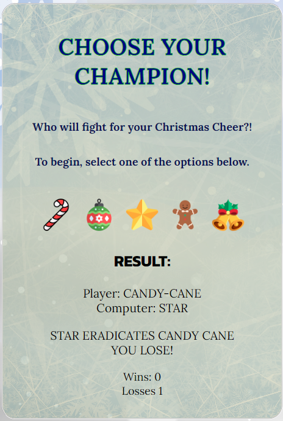

# Jingle Jubilee Joust - My Milestone Project

Welcome to my second milestone project, Jingle Jubilee Joust.

The purpose of this project is to demonstrate my learning and understanding of the JavaScript modules that I have completed so far and to implement them into a live project. This was a great opportunity to showcase my skills in design and development. The project is a functional website, built with HTML, CSS and JavaScript. It features a fully operational JavaScript game, further building on my HTML and CSS skills.

Below, I will outline each step of the process and my reasonings used to plan this project. I will reference my sources and highlight my focus on user experience design.

Thank you for taking the time to view my project and I truly hope you enjoy it as much as I did designing and developing it.

<a href="https://hcaldwell95.github.io/jingle-jubilee-joust/" target="_blank">View live project here</a>

## UX - User Experience Design

The inspiration behind the planning of this project comes largely from my love of Christmas and my recent binge of <a href="https://en.wikipedia.org/wiki/The_Big_Bang_Theory" target="_blank">The Big Bang Theory </a>which features the fan made: <a href="http://www.samkass.com/theories/RPSSL.html>" target="_blank">Rock, Paper, Scissors, Lizard, Spock</a> game, created by Sam Kass and Karen Bryla. 

By thinking of the user experience through each step of this design journey, it has resulted in a more positive experience and general feel.

I have broken down the planning into the five planes:
- __The Strategy Plane__ 
- __The Scope Plane__
- __The Structure Plane__
- __The Skeleton Plane__
- __The Surface Plane__
  

## Strategy Plane

My aim as the creator of this project is to provide entertainment to my users and promote an enjoyable experience while visiting my webpage.

#### Creator Stories

Creator Goals
- I aim to ensure my project is easy to navigate.
- Due to my project consisting of only basic information regarding the game and the game itself, I want to ensure that the page is aesthetically pleasing.
- As a creator, I strive to invoke positive emotional responses from users.
- My content should be relatable. Any images, text or quotes should have purpose.
- I don't want to distract my users from the game that they have visited to play, so I need to invest time into establishing a structure that works well for my project.

Once I established my strategy, the most important consideration from the user's perspective was how a user would feel going through the project.

#### User Stories

First-time visitor goals:

- As a first-time visitor, I want instant clarity about the project's purpose upon landing on the page.
- I desire effortless navigation - all aspects of the project should be clearly labelled and easy to maneuver.
- I hope to find reinforcement and support for the content that I am consuming through fun imagery and engaging content.
- I aim to experience a sense of progression while navigating the page without feeling overwhelmed or lost.
- I want to enjoy a visually engaging experience without becoming fatigued.

Returning visitor goals

- As a revisiting user, I aim to have replayability and the ability pick up the rules of the game easily.
- I seek the ability to reference information sources or discover the origins of the provided content.

The user stories empower me to develop a clearer concept of the project's feature requirements and their relative priorities.

During my initial planning, I researched a number of other potential browser games and reviewed their websites. Many of these websites overloaded their users with so much content and vibrant colours which didn't coordinate well. Others I found to be lacking in colour and engaging imagery or insufficient detail about the game that I am playing.

I asked my friends and family members what elements of a browser game that they would be concerned with and their responses helped me to establish the core content for the website and where my focus should be.

## Scope Plane

Based on my strategy goals, I was able to establish that I wouldn't be able to implement everything that I had thought of and the suggestions of what users would like to see. It simply wasn't feasible for my initial release. 

The best solution for me to start creating was a minimum viable product, which would provide the core content that I had deduced from my research.

I decided to break my webpage down into manageable sections:

#### Section 1: Headings & Introduction - 

- The main heading, which should be fun and engaging to draw the user in.
- Sub-headings to allow me to break up my page and allocate content accordingly.
- An introduction to the game with a bit of lore to allow users to feel immersed in the world I am creating.

#### Section 2: Core Features (JavaScript) - 

- I really wanted to include a countdown timer to Christmas as it would allow my users to truly get into the Christmas spirit. This included some fun imagery and vibrant colours to keep the user engaged.
- The browser game and main focus of the webpage. This was to be fully functional and suitable enough for a user to be able to enjoy their experience and receive the result that they are expecting from this webpage.

#### Phase 3 (Future Features) -
- Additional interactive elements, further utilising the capabilities of JavaScript to enhance the user's experience.
- Light Mode/Dark Mode toggle or multiple themes to allow the page to remain relevant once the festive season is over.

Having a phased approach would allow me to release a functional website, containing all of the fundamental content that my users desire while allowing me to refine my design, better understand my flaws and collect feedback.

## Structure Plane

Recognising early in the project that it would be heavily dependent on the visuals and interactivity, the main challenge was ensuring user engagement and providing enough content and features to retain their attention. I sought inspiration through a long list of familiar websites, shortlisting all that felt good and met the standard that I was looking for. From this list, I reviewed their structure and came up with my own layout to recreate that feeling.

The colour palette for my project was based on an Icy, Sweet / Candy-like, Homely concept. I wanted the website to feel clean and cut like modern pages, consisting of neatly organised segments, while retaining a fun and exciting colour palette which paid homage to the festive season. 

I made the decision to utilise an image as the entire background. This allowed me to be consistent with my styling and enabled me to include whimsical features such as a candy-cane border!

#### Typography:-

- Lora
- Kanit
- Permanent Marker

I chose these fonts because they are subtle and cohesive. They allowed for just easy separation between headings and paragraphs that didn't draw your attention too much while remaining fun. Both fonts are very easy to read, making it accessible to most people.

#### Additional Considerations

- Including the Christmas countdown feature was a priority for me. I wanted my webpage to be more than just a single experience for the user and this method was perfect for my vision.

- Uniform imagery and font styling throughout the project helps my users to build a familiarity throughout the project.

- The text will be consistent on all (future)pages in fonts and colors with subtle changes to layouts and positioning to prevent monotonous scrolling through similar looking content.

- Responsive design across all devices guarantees proper image scaling and readability without pixelation, making content accessible to a wide range of users.

## Skeleton Plane

I found it beneficial to prepare written drafts of all my ideas in advance. This approach allowed me remove content which I deemed irrelevant and also proofread and correct any grammatical errors for the content that I intended on implementing; all while providing a structured foundation for my content. Writing the content in advance allowed me to carefully plan text placement, paragraph structure, and the use of subheadings.

I mocked up a few designs on MicrosoftWord and ProCreate, simply for the general layout and flow of the website and this allowed me to assemble the elements into my final design.

## Surface Plane

In the features section below, you will see all of the features that I have implemented in their final form, thus forming the Surface Plane.

## Features

### Existing Features

- __Logo__
  - The logo for my project is stamped in the top centre of the screen. This serves as a constant reminder of where the user is and promotes connection.

   

  

 

- __The Landing Page__

  - The Landing Page features thematic frosty background, followed up by vibrant, colourful content to enable the user to be drawn in. The first bit of content is the 'GAME BRIEF', offering users a clear sense of the site's purpose and what they should expect. This section introduces the website and reassures users that they are in the right place.

   

 

- __Christmas Countdown Section__

  - The Christmas Countdown section will allow the user to see exactly how far away Christmas is and will add to their festive experience. This user will see the value of returning to this website and to receive an update on how long they have to wait until Christmas.

   

  

- __The Game Section__

  - This section is the main purpose of this webpage. It displays a title instructing the user on their next step, followed by a brief description on how to begin the game.
  - As the name suggests, the game is situated within this section and this is where our users will be aiming to be while browsing our webpage.
  - Initially, the game section only shows the brief on how to begin the game, along with the five options available to the user. Once a choice has been made, the area expands, revealing the results of their decision.
 
  

 

- __The Game Section (Continued...)__

  - Once a choice has been made, the area expands, revealing the results of their decision.
  -There is a score counter at the bottom to keep track of the user's current scores. This is incremented accordingly every time the game is played.

 

</a>

## Testing

### Further Testing

- The project was tested on the following browsers with success: Google Chrome, Microsoft Edge and Mozilla Firefox.
- The project was manually tested on an iPhone SE, iPhone 12 and iPad Pro 12.9 and a laptop with success.
- Google Chrome Developer tools were used throughout the project to help test the responsiveness across multiple device options.
- Google Chrome Developer Tools used to emulate screen sizes below:
  - 360px x 640px (Standard Phone)
  - 810px x 1080px (iPad)
  - 1280px x 900px (Laptop)
  - 1440px x 900px (Desktop)

### Validator Testing

I used the  <a href="https://validator.w3.org/">W3C HTML Validator</a> and <a href="https://jigsaw.w3.org/css-validator/">W3C CSS Validator</a> to validate every page of the project to ensure there were no syntax errors in the project.

- I received the errors below when passing my webpage HTML through the official <a href="https://validator.w3.org/">W3C Markup Validator</a>.

 

    - To fix this, I removed the redundant trailing slash from line 10 and also the obsolete backgroudn attribute from line 19. This resolved the error.

- I received the errors below when passing my webpage CSS through the official <a href="https://validator.w3.org/">W3C Markup Validator</a> for my CSS

 

    - To fix this, I fixed the typos in the font-size styles on lines 13 and 242. I then amended the max-height value to a suitable figure.

### Unfixed Bugs

When implemnenting this webpage on a larger screen, particularly one with considerable height, you may observe that the background image either repeats or terminates. To address this, I would need to explore methods to ensure this image stretches to cover the entire screen while retaining its original aspect ratio.

## Deployment

#### Github

This project is deployed using GitHub pages using the following process,

#### Deploying a GitHub Repository via GitHub Pages

1. In your <em>Repository</em> section, select the <em>Repository</em> you wish to deploy.
2. In the top horizontal Menu, locate and click the <em>Settings</em> link.
3. Inside the <em>Setting</em> page, around halfway down locate the <em>GitHub Pages</em> Section.
4. Under <em>Source</em>, select the None tab and change it to <em>Main</em> and click <em>Save</em>.
5. Finally once the page resets scroll back down to the <em>GitHub Pages</em> Section to see the following message "Your site is ready to be published at (<em>Link to the GitHub Page Web Address</em>)". It can take time for the link to open your project initially, so please don't be worried if it down not load immediately.

#### Forking the Github Repository

You can fork a GitHub Repository to make a copy of the original repository to view or make changes without it affecting the original repository.

1. Find the GitHub repository.
2. At the top of the page to the right, under your account, click the <em>Fork</em> button.
3. You will now have a copy of the repository in your GitHub account.

#### Making a Local Clone

1. Find the GitHub Repository.
2. <em>Click</em> on the Code button.
3. <em>Copy</em> the link shown.
4. In <em>Gitpod</em>, change the directory to the location you would like the cloned directory to be located.
5. <em>Type</em> <code>git clone</code>, and <em>paste</em> the link you copied in step 3.
6. Press <em>Enter</em> to have the local clone created.

The live link can be found here - <https://github.com/HCaldwell95/jingle-jubilee-joust>

## Credits

#### Code

- <a href="https://codeinstitute.net/" target="_blank">Code Institute, Various Tutors</a>
  - Returning to the course content helped me to find solutions to many of my coding issues/queries and allowed me to refer to specific modules for further guidance.
   

  - My mentor, Harry Dhillon, has been detrimental to this project's success. His guidance and clear instruction regarding project requirements were invaluable. He effectively provided advice on my suggestions and shared insightful opinions on my work, which I greatly appreciated.

- <a href="https://codepen.io/763004/pen/pPGGyP?editors=1010" target="_blank">CodePen user, Brennan</a>
  - General understanding and visual aid of the JavaScript functions required to power a 5-way rock, paper, scissors game. The code demonstrated provided a strong foundation for my game.

- <a href="https://www.w3.org/" target="_blank">World Wide Web Consortium (W3C)</a>
  - Provided access to many 'How To' pages which enabled me to better understand some functionality of my webpage.

- <a href="https://www.w3schools.com/" target="_blank">W3 Schools</a>
  - Provided insight on implementing a border-image like I have used on my introduction-area. <a href="https://www.w3schools.com/cssref/css3_pr_border-image.php" target="_blank">Link to page</a> 
   

  - Provided instructional code for implementing a countdown timer like I have used on my countdown-area. <a href="https://www.w3schools.com/howto/howto_js_countdown.asp" target="_blank">Link to page</a>
 
- <a href="https://kinsta.com/blog/css-text-outline/" target="_blank">Kinsta</a>
  - Demonstrated the use of '-webkit-text-stroke-' applications which allowed me to implement into my own project.
- <a href="https://chat.openai.com/" target="_blank">ChatGPT</a>
  - Provided constant code checking and alternative methods. I utilised ChatGPT a lot when encountering errors with the workspace or certain bugs that would appear. It was very helpful to have the errors explained and broken down, allowing me to resolve them with ease.

### Media
  
  - Favicon: https://favicon.io/emoji-favicons/christmas-tree

  - candy-cane-border.jpg: 

  - frozen-glass:
  Image by <a href="https://www.freepik.com/free-vector/realistic-ice-texture-illustration_22900014.htm#query=frozen glass&position=8&from_view=search&track=ais&uuid=5244508f-d949-4938-9a0c-ee0014b5e54e](https://www.freepik.com/free-vector/realistic-ice-texture-illustration_22900014.htm#query=frozen%20glass&position=8&from_view=search&track=ais&uuid=5244508f-d949-4938-9a0c-ee0014b5e54e)">Freepik</a>

  - dark-wood-background: <a href="https://www.freepik.com/free-photo/brown-wood-texture-high-resolution-background-image_17117475.htm#page=2&query=wooden plank texture&position=0&from_view=search&track=ais&uuid=85230b34-3e93-431c-8bba-2ab734928c40](https://www.freepik.com/free-photo/brown-wood-texture-high-resolution-background-image_17117475.htm#page=2&query=wooden%20plank%20texture&position=0&from_view=search&track=ais&uuid=85230b34-3e93-431c-8bba-2ab734928c40)">Image by rawpixel.com</a> on Freepik

  - border-image: https://www.w3schools.com/cssref/css3_pr_border-image.php

  - hanging-sign.png: https://www.rawpixel.com/image/12796128/png-christmas-celebration

- frosty-background.jpg: <a href="https://www.freepik.com/free-vector/unfocused-winter-landscape-with-snowflakes_6029361.htm#query=christmas background&position=10&from_view=keyword&track=ais&uuid=f998f5f5-172e-40a6-87b0-686a00a623dd](https://www.freepik.com/free-vector/unfocused-winter-landscape-with-snowflakes_6029361.htm#query=christmas%20background&position=10&from_view=keyword&track=ais&uuid=f998f5f5-172e-40a6-87b0-686a00a623dd)">Image by s.salvador</a> on Freepik

- bauble.png: https://www.rawpixel.com/image/12874290/png-christmas-ball-neon-light-night-generated-image-rawpixel

- candy-cane.png: <a href="https://www.flaticon.com/free-icons/christmas" title="christmas icons">Christmas icons created by Freepik - Flaticon</a>

- star.png: <a href="https://www.flaticon.com/free-icons/christmas" title="christmas icons">Christmas icons created by Md Tanvirul Haque - Flaticon</a>

- gingerbread.png: <a href="https://www.flaticon.com/free-icons/christmas" title="christmas icons">Christmas icons created by iconixar - Flaticon</a>

- jingle.png: <a href="https://www.flaticon.com/free-icons/christmas" title="christmas icons">Christmas icons created by Md Tanvirul Haque - Flaticon</a>

- <a href="https://ui.dev/amiresponsive?url=https://hcaldwell95.github.io/salt-and-stone-studios/">Am I Responsive?</a> - Provided image used at the top of README.md to demonstrate responsiveness.

- All fonts were taken from <a href="https://fonts.google.com/">Google Fonts</a>.

## Other General Project Advice

#### GitPod

I renamed my repository on GitHub and for a moment, thought that I needed to open a new workspace to suit (I didn't know I could just rename my workspace!). During this brief switch to the new workspace, I tried to push some changes but noticed that the changes were not being refelcted on the live page. After I realised that I could change my workspace name, I went back into my original workspace and tried to push my changes which return an error.

I managed to 

#### GitHub

During this project, my account was migrated to a Code Institute student account. All of my repositories and access remained, but when reviewing the git logs, there is a difference shown between my profile during this stage. Both profiles share the name of HCaldwell95, but at first glance it appears that the git commits come from another user. I can confirm that all commits have been from myself and no other user has ever accessed my project. I believe this is due to the account migration.